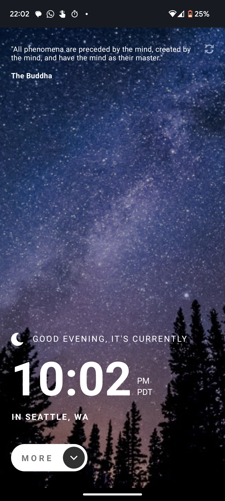
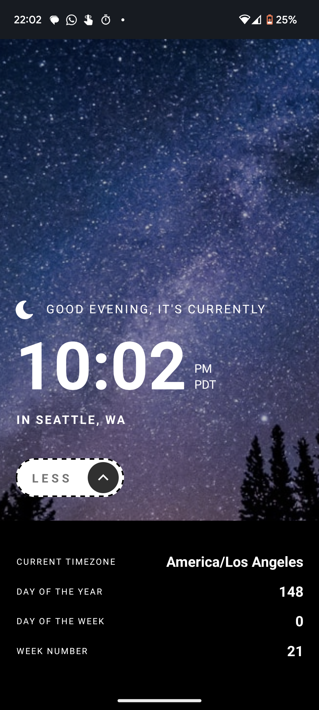
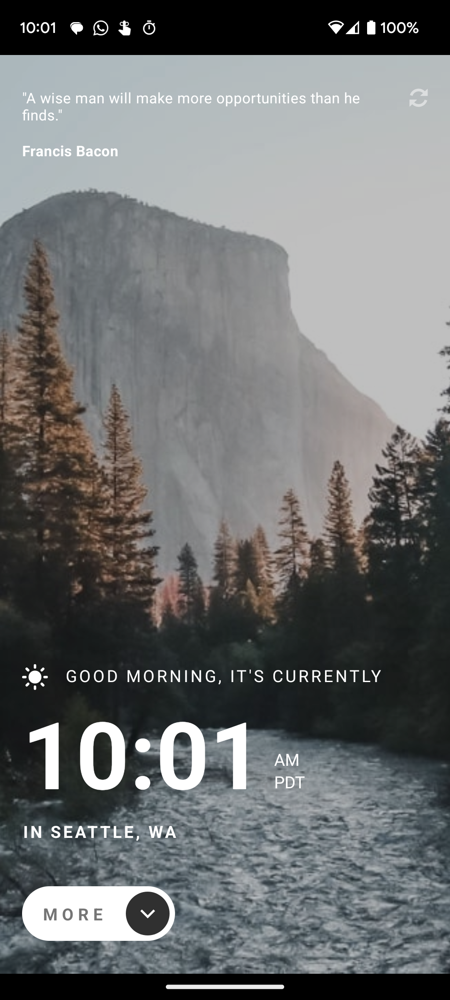
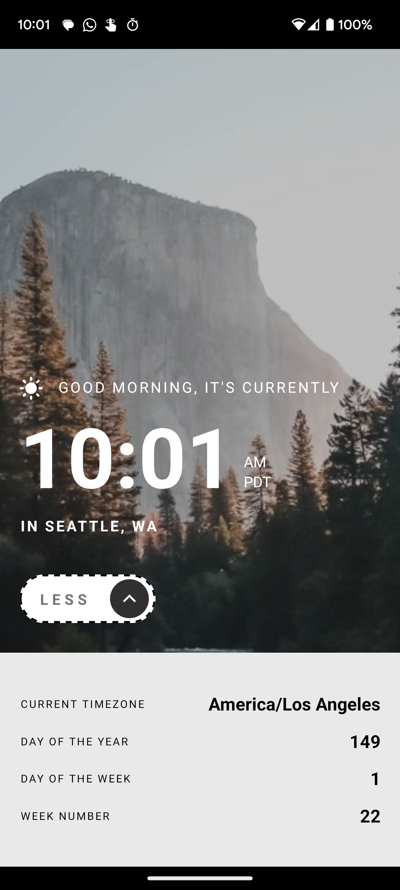

# QuoteClock

Coded by: Katie Taylor

I developed a clock and quote app with time-adaptive theming for my Mobile Development class at Western Washington University.

I coded the app with React Native. You can run the app with Expo with `npx expo start`, and connect to the Metro bundler with Expo Go or on your computer with an Android simulator/iOS emulator.

## Overview

Users can:

* view the current time and location information based on their IP address
* view/hide additional information about the date and time in the expanded info panel by clicking the MORE/LESS button
* view the correct greeting, background image and expanded info panel colors based on the time of day
* generate "infinite" famous quotes by clicking the refresh icon near the quote

I implemented time-adaptive theming in the app using context:

* The greeting icon, background image and expanded info panel colors change depending on the time of day:
  * A sun icon, daytime background image and dark text on a light background in the expanded info panel between 5am and 6pm
  * A moon icon, nighttime background image and light text on a dark background in the expanded info panel between 6pm and 5am
* The greeting changes depending on the time of day:
  * "Good morning" between 5am and 12pm
  * "Good afternoon" between 12pm and 6pm
  * "Good evening" between 6pm and 5am

I used the following APIs for this project:

* World Time API (http://worldtimeapi.org/) to fetch the time data based on the user's IP address
* IP API (http://ip-api.com/) to fetch the location data
* Quotes API (https://api.quotable.io/random) to generate random quotes (on initialization and whenever the refresh icon is clicked)

I automated testing for the core functionality using Jest. You can run the test suite with `npm run test` or `npx jest`.

## UI Preview

The UI looks as follows (also in [the design folder](./design/)):

